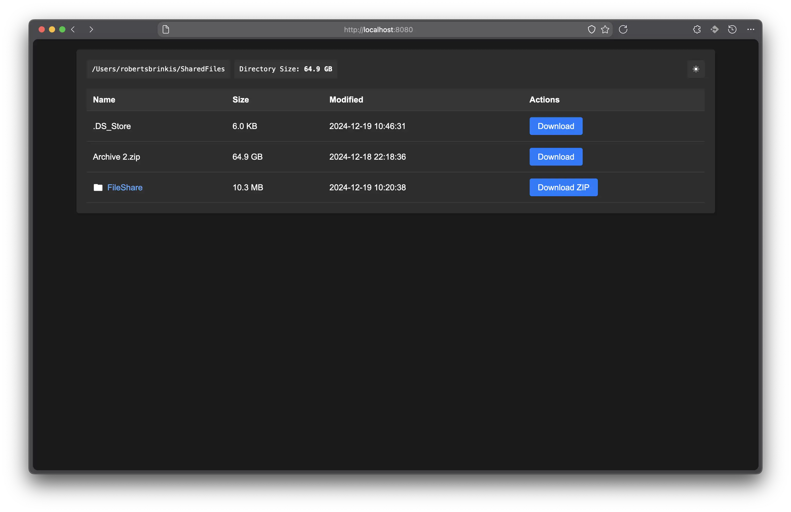

### FileShare

This is a simple file server written in Go. It serves files from a specified directory and provides a simple web interface for browsing and downloading files.

### Installation

Install the exetuable by downloading the latest release from the [releases page](https://github.com/amixaam/FileShare/releases/).

### Usage

To use the file server, you need to specify the directory to serve files from. By default, the server will serve files from the `~/SharedFiles` directory. You can specify a different directory using the `-dir` flag.

```
./fileshare -dir /path/to/directory
```

The server will start listening on port 8080 by default. You can specify a different port using the `PORT` environment variable.

```
PORT=8000 ./fileshare
```

### Features

-   Serves files from a specified directory
-   Provides a simple web interface for browsing and downloading files
-   Supports ZIP downloads for directories
-   Displays file sizes in human-readable format
-   Displays total size of directory
-   Displays local IP addresses for easy copy and paste to other devices
-   Column sorting for file listing
-   Dark / light mode toggle

### Screenshots


